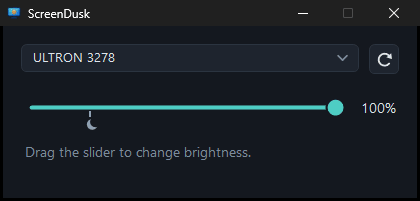

# ScreenDusk

A brightness slider for your monitors on Windows.

- Changes the monitor's real backlight over DDC/CI.
- Below the moon mark, dims the screen past the monitor's own minimum.
- Each monitor is adjusted on its own.

## Run

Download `ScreenDusk.exe` from [Releases](https://github.com/thisisiron/ScreenDusk/releases) and run it. Nothing to install.
To build it yourself, run `build.cmd`.
